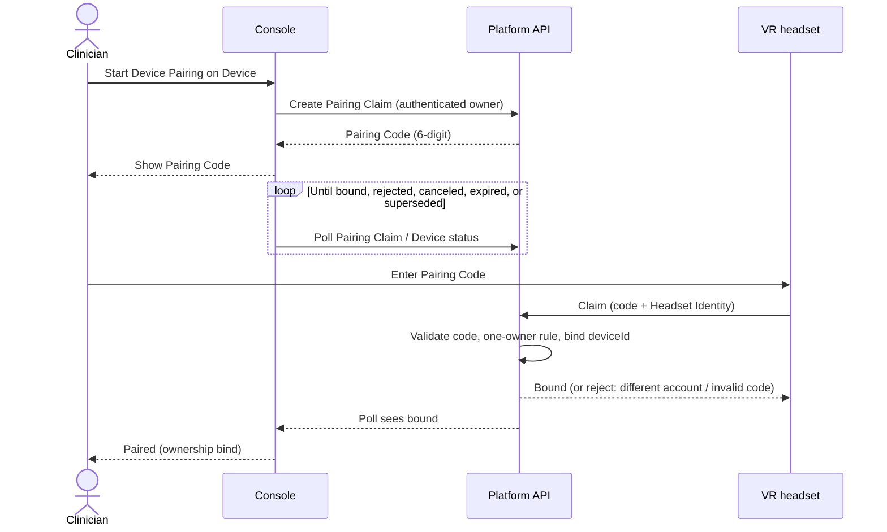
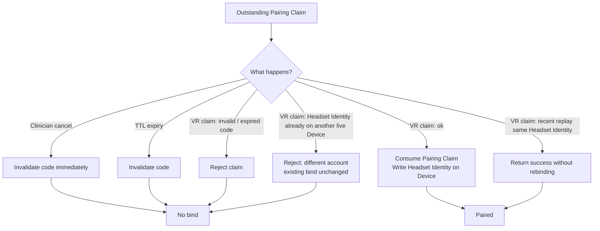
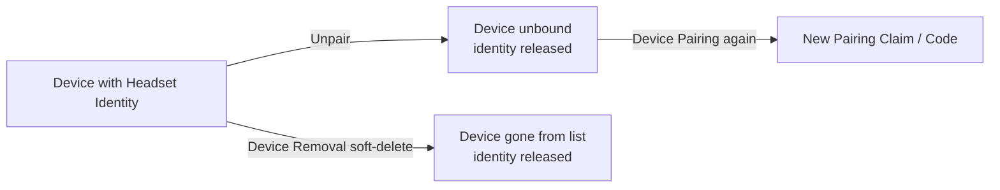

# Device Pairing Out-of-Band Bind

**Status:** accepted

**Device Pairing** binds a durable **Headset Identity** to a console Device out-of-band: the clinician creates a short-lived **Pairing Claim**, the console shows a 6-digit **Pairing Code**, and the VR claims over HTTPS. Socket.IO is not used for the bind. The platform API and PostgreSQL are authoritative; Redis and temporary pair-code rooms are not part of pairing correctness.

## Decision

1. **Out-of-band bind only.** Pairing establishes ownership (`Device.deviceId` / **Headset Identity**). It does not open a Socket.IO pair room. Live treatment communication uses Socket.IO only after a successful bind.
2. **Console-initiated 6-digit claim.** The Device owner creates a **Pairing Claim**; the console shows a 6-digit **Pairing Code** (no QR in this design). The VR claims over REST with the code plus its **Headset Identity**. Possession of a valid, unexpired, unconsumed code is the capability for claim; no separate headset login.
3. **Paired means ownership.** Success is a persisted bind, not presence of a live peer. The console observes completion by polling **Pairing Claim** / Device status until bound, rejected, canceled, expired, or superseded.
4. **Cancel, expiry, and consume.** Clinician cancel invalidates the outstanding code immediately. TTL expiry also invalidates. A successful claim consumes the **Pairing Claim** so it cannot bind again. A short replay window may still return success for the same **Headset Identity** repeating a recently completed claim, so a lost HTTP response does not strand the VR.
5. **One live owner.** At most one live Device bind per **Headset Identity** (soft-deleted Devices do not count). A conflicting claim rejects; the existing bind is unchanged (no steal). User-facing sense: already paired to a different account (do not name the other user). Enforcement is server-side at the bind write, with a database uniqueness guarantee on live `deviceId` values (soft-delete clears `deviceId`, so a unique index on `Device.deviceId` is sufficient).
6. **Recovery.** Changing which headset a Device owns requires **Unpair** then a new **Device Pairing** (no in-place overwrite). **Unpair** clears and releases the identity without deleting the Device; it is console owner-only and does not require the headset. **Device Removal** (soft-delete) also releases any bound identity. **Unpair** is ownership-only: live Role Slot / presence cleanup is best-effort and must not gate Unpair success.
7. **Treatment room addressing.** After the split, treatment and presence continue to address rooms by **Headset Identity** (today’s post-pair `deviceId` as `roomCode`). Redesigning session/room keys is out of scope here.
8. **VR coordination and rollout.** New console and VR clients use the claim path only and do not join pair-code rooms. Fresh pairing requires the new VR build. Unused pairing-only socket events may linger until old clients are gone; they are not a dual-path for new clients.
9. **v1 claim surface.** Store the raw **Pairing Code** (no HMAC/pepper yet). No custom rate limiter on the public claim route in v1. The VR may check whether a **Headset Identity** is already registered so a timed-out claim can recover without rebinding.

Claim protocol shape: create, code, claim, TTL, consume-with-replay, poll, uniqueness. Concrete TTL values, poll intervals, and route inventory live in [`docs/architecture/server-owned-device-pairing-guide.md`](../architecture/server-owned-device-pairing-guide.md).

## Flow

Happy-path bind (Socket.IO is not involved):

Outcomes that stop a claim without binding (or without changing an existing bind):

Recovery before a different headset can bind to the same Device:

After a successful bind, treatment connects with Socket.IO using **Headset Identity** as the room address (not the **Pairing Code**).

## Rejected alternatives

| Alternative                                             | Why rejected                                                                                                                              |
| ------------------------------------------------------- | ----------------------------------------------------------------------------------------------------------------------------------------- |
| Hardened in-room Socket.IO pairing                      | Pair-room Role Slot leftovers already cause stale peers and post-pair connect failures; hardening keeps bind coupled to the live channel. |
| Hybrid temporary pair room during bind                  | Same stale-connection class of failure; undermines the bind vs treatment diagnosis split.                                                 |
| Reverse (headset shows code; clinician confirms) for v1 | Credible UX alternative, but console-initiated code ranked stronger for this product; defer.                                              |
| QR (alone or alongside code) for v1                     | Out of recommended path; 6-digit code only.                                                                                               |
| Dual-path for new clients (old pair room + new claim)   | Reintroduces the failure modes this redesign removes; new console and VR use claim only.                                                  |
| Steal / transfer on conflicting claim                   | Violates one-owner clarity; freeing an identity requires explicit **Unpair** or **Device Removal**.                                       |
| Blocking Unpair on VR reachability                      | Contradicts ownership-only **Unpair**; headset may be offline when the clinician needs to clear a bad bind.                               |
| Redis as pairing authority                              | Pairing must survive browser lifecycle and give the VR a definitive API response; PostgreSQL owns claim state.                            |

## Consequences

- Console and platform API own **Pairing Claim** / **Pairing Code** lifecycle and the bind write; socket stays a post-pair communication bridge.
- `Device Removal` must release **Headset Identity** (soft-delete clears `deviceId`).
- VR client must implement REST claim (and optional registration check) and stop using pair-code rooms; console pair UI drops Socket.IO for pairing and polls for outcome.
- Implementation contracts and deployment order: [`docs/architecture/server-owned-device-pairing-guide.md`](../architecture/server-owned-device-pairing-guide.md).

## References

- Map: [Device Pairing redesign path](https://github.com/Virtality-app/virtality-platform/issues/19)
- Research: pair-room stale connections; out-of-band pairing patterns (`docs/research/`, branches from map research tickets)
- Domain language: `apps/console/CONTEXT.md` (**Device Pairing**, **Headset Identity**, **Pairing Code**, **Pairing Claim**, **Unpair**, **Device Removal**)
